科大讯飞-测试技术部

## 一、常用组件及作用域

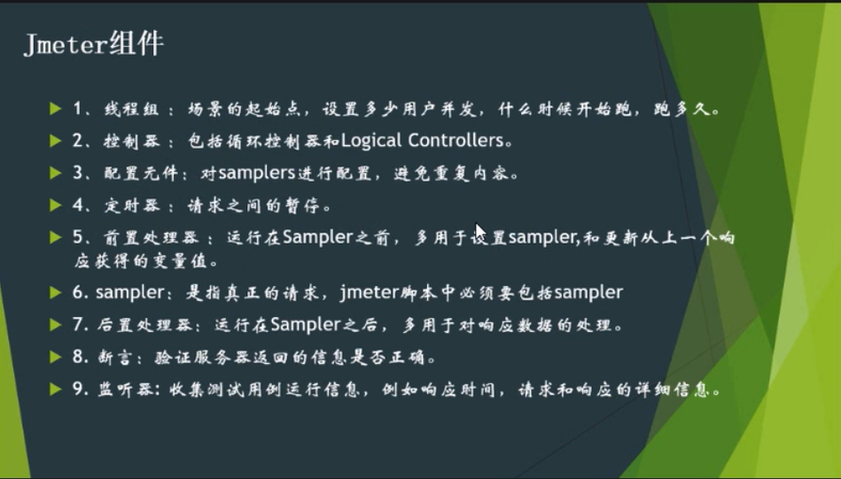

### 1.线程组--主要做自动化，性能也可以用（不常用）

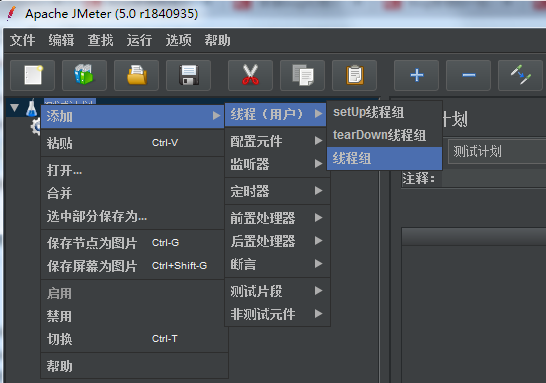

### 2.配置元件

#### HTTP Cookie管理器

- 类似浏览器中的session

  维护脚本运行中的session。权限校验需要维护session。（比如维持用户的登录状态）

- 作用域（多用户场景时，维持每个用户的状态）

- 每次反复清除Cookies？

  自动化脚本每次只跑一次，可以不勾选

  性能脚本跑多次，必须勾选。（否则后面都以第一次登录状态为准）

#### HTTP信息头管理器

Jmeter3.0以后，录制出的消息头和实际请求中发的消息头是一样的。不会存在消息头缺少字段的情况。

- content-type：前端和服务器之间数据交互的协议，json、xml，form_url

- referer：有时也会影响消息成功率

- accept-encoding：

- accept：

  web层，可以录制脚本，可以不用关注消息头

  接口层，jmeter就录不了，自己去写。 

#### 

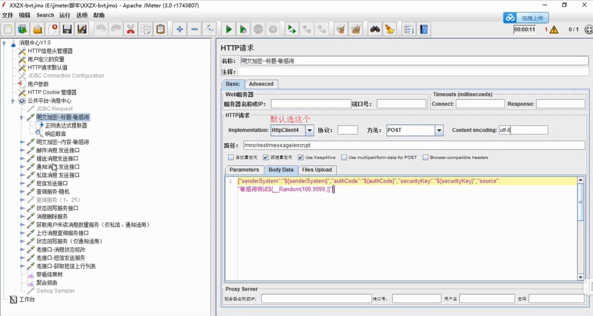

#### HTTP请求默认值

设置请求默认值，后面的就不用填

#### 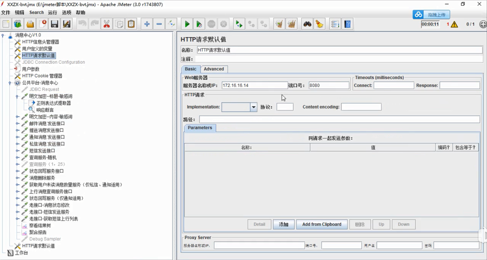

#### 用户定义的变量

这个元件定义的参数是全局变量，不管放在哪里，都 作用于整个测试计划。不分作用域。

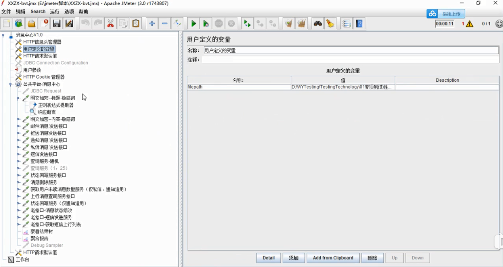

### 3.定时器

- **固定定时器**

像LR中的思考时间。模拟用户操作习惯

- **高斯随机**

固定300毫秒，上下偏差100毫秒。即200-400毫秒

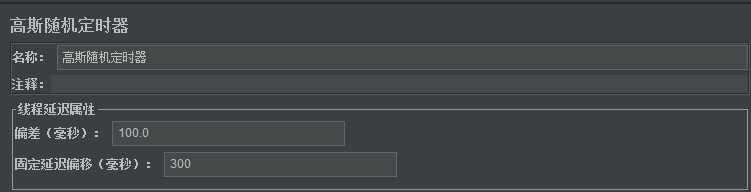

### 4.前置处理器

对sampler而言，用于设置sampler，和更新从上一个响应获得的变量值。

线程组-添加-sampler（取样器）-HTTP请求

### 5.断言

判断接口返回值正确与否

- BeanShell断言

- 响应断言

### 6.监听器

聚合报告：查看整体情况

查看结果树：所有接口跑出来，可以查看详细的结果

Transactions per Second：查看tps

Response Times Over Time：请求的响应时间

PerMon Metrics Collector：监控资源的使用情况

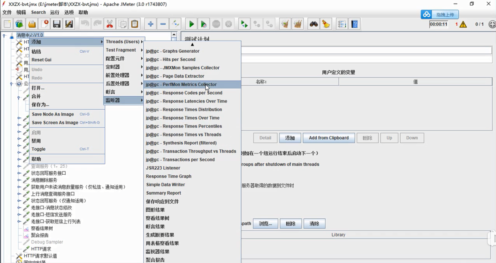

#### 7.Jmeter组件执行顺序

只有Sampler存在，前置/后置处理器、用户参数、定时器、断言，才会有效，才会被运行。

逻辑控制器和Samplers按它们在树里的排列顺序执行。

1. 配置元件
2. 前置处理器
3. 定时器
4. 取样器Sampler
5. 后置处理器
6. 断言
7. 监听器

#### 8.作用域

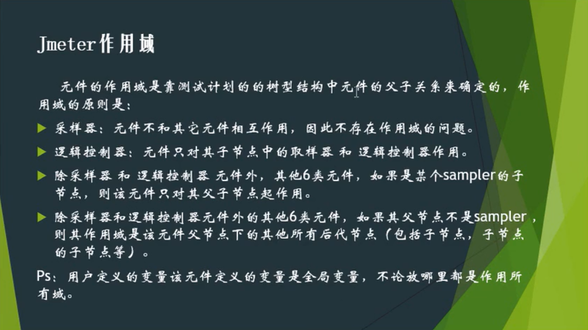

## 二、脚本录制编写方法

### 1.手写

需要详细的接口文档，方法、消息头等

### 2.badboy录制

jmeter3.0前，问题多，需要自己排查，效率低

### 3.fiddler录制

导出jmx脚本，放到jmeter中。

### 4.jmeter录制

设置IE代理

**分组**

性能测试：put each group in a new transaction controller（事务控制器）

自动化测试：每个组放入一个新的控制器（检查控制器）

**包含模式**

过滤条件，比如url地址

**排除模式**

排除一些静态资源

**User Defined Variables**

自动化脚本，把环境参数（IP）封装成用户自定义参数，再录制的时候，jmeter就自动把录到的相关参数进行参数化。

## 二、脚本编写

### 1.脚本录制

### 2.参数关联

当前请求用到上一个请求的返回值，与上一个请求返回的结果进行关联。

上一个请求，-后置处理器-正则表达式提取器

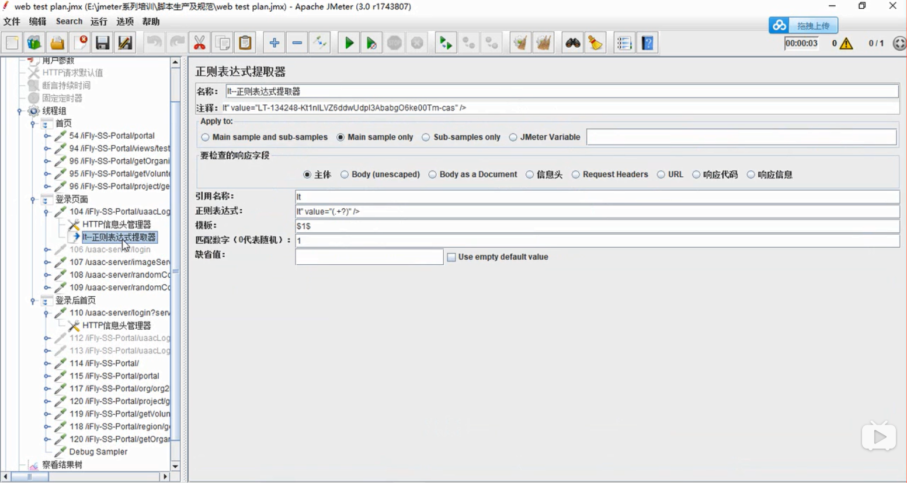

### 3.调试

### 4.变量的提取

### 5.脚本编写格式

依据命名规范，增强可读性，方便查看结果

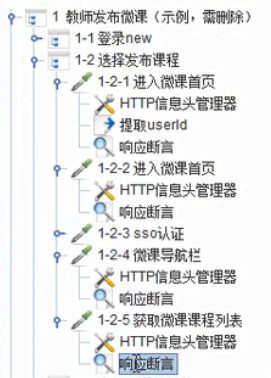

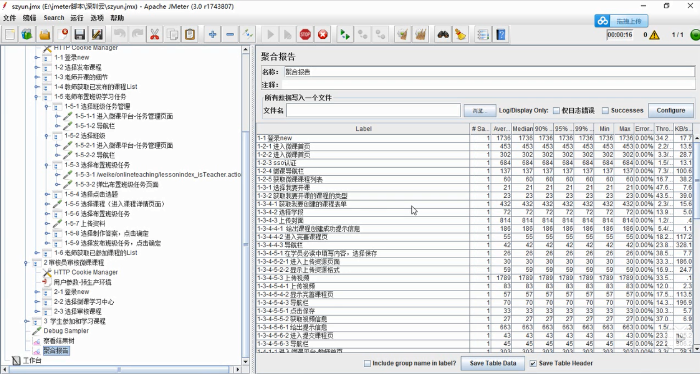

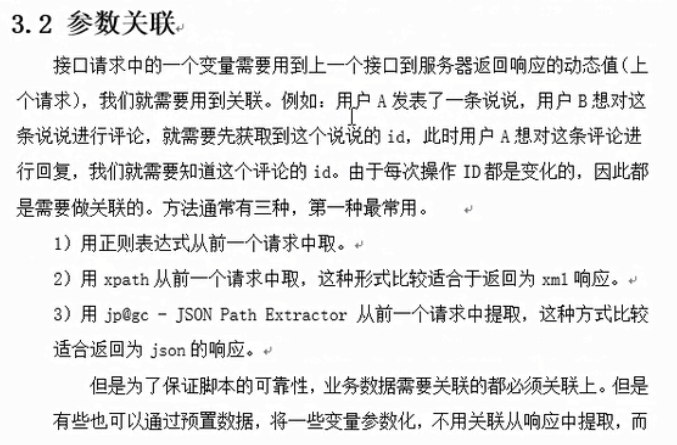

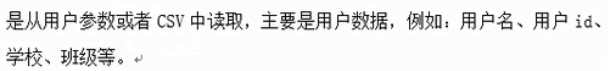

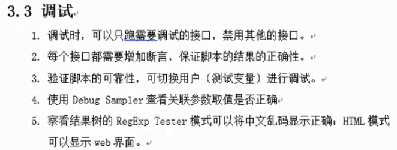

用户数据，可以将其参数化

业务内部的参数，用关联

3.3调试 

2.做自动化，每个接口都要加断言。不加断言，也能通过，也是200，但其实没成功

4.脚本中需要关联的参数，如果ID取到了，可能是传参没传对，或者传参的格式写错了。

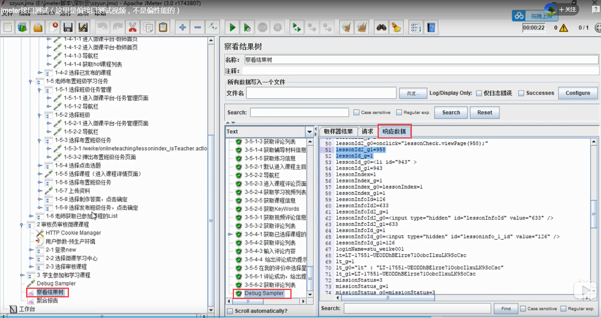

 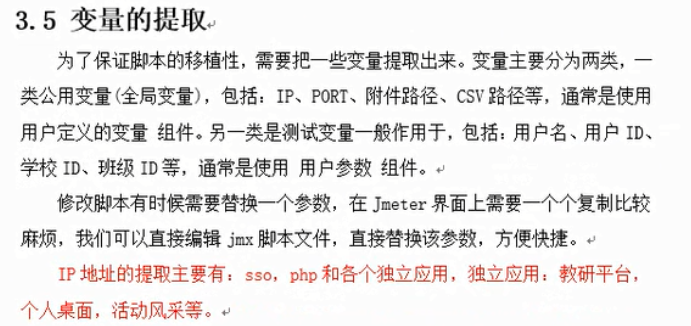

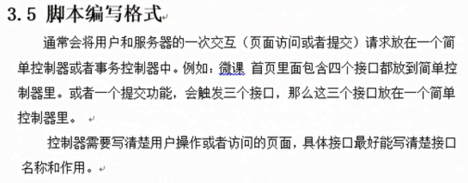

自动化放到检查控制器，性能放到事务控制器。

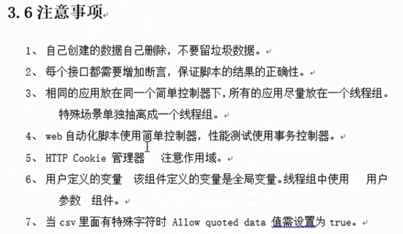

1.删除方法：业务中有的删除请求，连接数据库直接删除。

## 三、创建一个web自动化测试脚本

以一个页面，即用户和服务器的一次交互，作为一个事务

创建一个jmx模板，节省每次添加组件的时间

录制过程中的灰色url，是访问上一个请求成功后，服务器主动请求的，实际IE浏览器不会有这个请求。可以不用关注（可以删除）

参数化

${参数名}

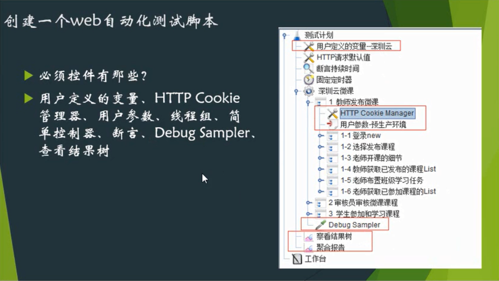

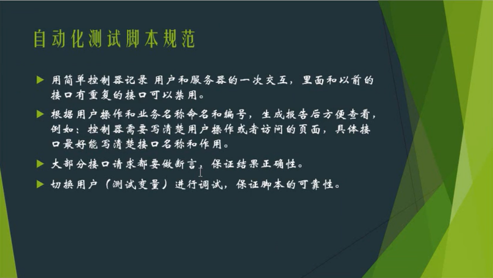

## 四、创建一个web性能测试脚本

## 五、问题解答

